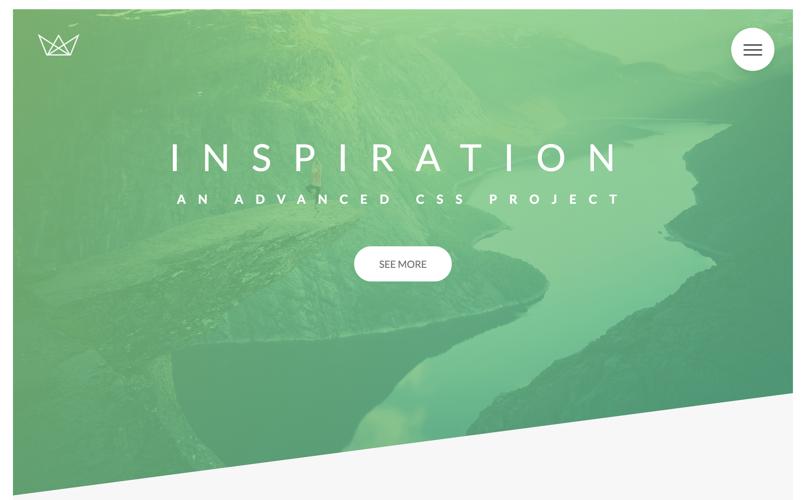

# Inspiration

This is a project built for learning and practicing advanced CSS and SASS for a class (see acknowledgements).  It's built with pure HTML and CSS.  I've sprinkled in some cheesy inspirational quotes that love for the dummy content (hence the name).

## Demo
[https://css-inspiration.surge.sh/](https://css-inspiration.surge.sh/ "Inspiration")

## Screenshot


## Getting Started

To view the website, clone the repo and open the index.html file.  That's it!

The project is built in Node.js, and the CSS is built using Sass.

To install:

```$ npm install```

To compile Sass:

```$ npm run compile:sass```

## Acknowledgments
Major shout out to [Jonas Schmedtmann](https://codingheroes.io/ "Coding Heroes"), the site designer and the teacher of the Advanced CSS and SASS class on Udemy.  I give a million stars to his class!  It's content-packed and fun, and is designed to teach how to manage CSS for a large project.
